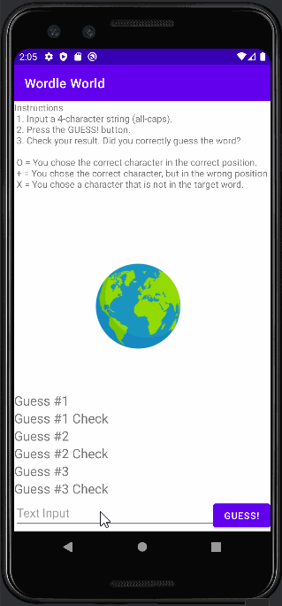

# Android Project 1 - Wordle World

Submitted by: Merlin Mallory

Wordle World is an android app that recreates a simple version of the popular word game [Wordle](https://www.nytimes.com/games/wordle/index.html). 

Time spent: **5.5** hours spent in total

## Required Features

The following **required** functionality is completed:

- [X] **User has 3 chances to guess a random 4 letter word**
- [X] **After 3 guesses, user should no longer be able to submit another guess**
- [X] **After each guess, user sees the "correctness" of the guess**
- [X] **After all guesses are taken, user can see the target word displayed**

The following **optional** features are implemented:

- [ ] User can toggle betweeen different word lists
- [ ] User can see the 'correctness' of their guess through colors on the word 
- [ ] User sees a visual change after guessing the correct word
- [X] User can tap a 'Reset' button to get a new word and clear previous guesses
- [ ] User will get an error message if they input an invalid guess
- [ ] User can see a 'streak' record of how many words they've guessed correctly.

The following **additional** features are implemented:

* [X] List anything else that you can get done to improve the app functionality!
- Added game instructions and a background image.

## Video Walkthrough

Here's a walkthrough of implemented user stories:

<!-- Replace this with whatever GIF tool you used! -->
GIF created with LICEcap  
<!-- Recommended tools:
[Kap](https://getkap.co/) for macOS
[ScreenToGif](https://www.screentogif.com/) for Windows
[peek](https://github.com/phw/peek) for Linux. -->

## Notes

Describe any challenges encountered while building the app.

The biggest challenge was attempting the "User can see the 'correctness' of their guess through colors on the word" stretch goal. I was able to figure out how to validate individual character, but I couldn't figure out how to colorize individual characters in a string. I think it would've been possible to divide the 3 output strings into 4 characters each, but it seemed like a hassle to individually colorize a total of 12 strings. I tried to find an easier way to colorize individual characters in a string, kinda like in HTML/CSS, but the solutions I found via Google were mostly for an older version of Java, instead of Kotlin. So I wasn't able to complete that stretch goal.

## License

    Copyright [2022] [Merlin Mallory]

    Licensed under the Apache License, Version 2.0 (the "License");
    you may not use this file except in compliance with the License.
    You may obtain a copy of the License at

        http://www.apache.org/licenses/LICENSE-2.0

    Unless required by applicable law or agreed to in writing, software
    distributed under the License is distributed on an "AS IS" BASIS,
    WITHOUT WARRANTIES OR CONDITIONS OF ANY KIND, either express or implied.
    See the License for the specific language governing permissions and
    limitations under the License.
